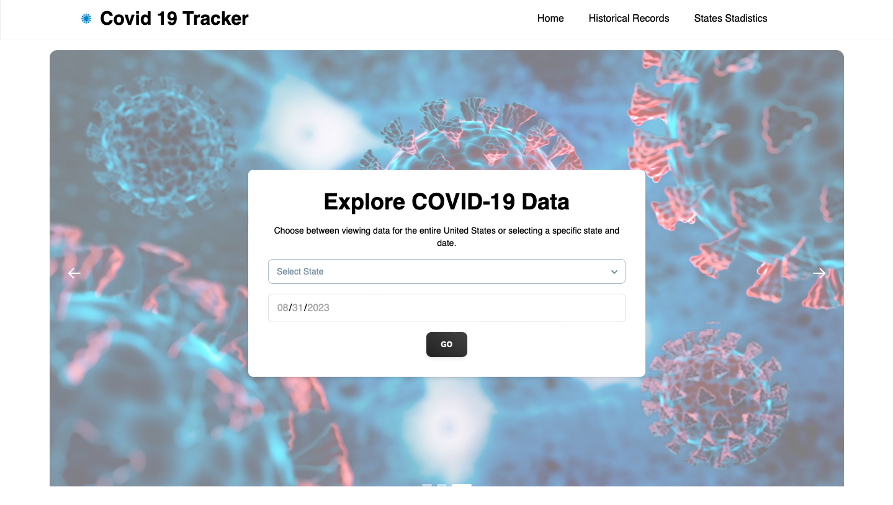

# COVID-19 Data Tracker - Frontend 📊🌍



## Table of Contents
- **Introduction**
- **Features and Highlights**
- **Project Setup and Usage**
- **Technology Stack**
- **Folder Structure**
- **Routing with Pages Directory**
- **Data Fetching with Custom Hooks**
- **Deployment on Netlify**
- **Best Practices**
- **License**
- **Contact**
- **Styling**
- **Process**
- **Authors**

## Introduction 🌟
Welcome to the frontend repository of the **COVID-19 Data Tracker** application! 🚀 This project is a web-based platform developed using Next.js and React, designed to provide users with **comprehensive insights and visualizations** of COVID-19 data from reliable sources.

## Features and Highlights ✨

- **Interactive Data Visualization**: Harness the power of React and Chart.js to create **dynamic and interactive graphs, charts, and maps** that present COVID-19 data in a visually engaging manner.

- **Responsive User Interface**: Enjoy a seamless user experience across various devices and screen sizes with a fully responsive frontend design.

- **Smooth Animations**: Elevate user engagement with **smooth animations** powered by the Framer Motion library, creating a delightful and informative UI.

- **Data Filtering and Customization**: Empower users to customize their data viewing experience with features like **date range selection** and filtering by location.

## Project Setup and Usage 🛠️

1. **Clone the Repository**: Begin by **cloning this repository** to your local machine.

2. **Install Dependencies**: Navigate to the project directory and **install the required dependencies** using `npm install`.

3. **Environment Variables**: Easily configure the necessary environment variables in a `.env` file as outlined in the documentation.

4. **Start the Development Server**: Run `npm run dev` to kickstart the development server. Open your browser and access `http://localhost:3000` to see the magic unfold.

## Technology Stack 💻🔮
This project thrives on the following cutting-edge technologies:

- **Next.js:** A React framework that empowers server-rendered React applications.
- **React:** A JavaScript library for crafting splendid user interfaces.
- **Tailwind CSS:** A utility-first CSS framework for rapid UI development. 🎨
- **Framer Motion:** A library for crafting captivating animations within React applications.
- **Chart.js:** A popular toolkit for generating interactive and customizable charts and graphs.
- **Axios:** A promise-based HTTP client for effortlessly making API requests.

## Folder Structure 📂

- **public**: Houses static assets like images.
- **src**:
  - **components**: Home to reusable UI components.
  - **hooks**: Hosts custom React hooks for efficient data fetching and logic.
  - **pages**: The heartbeat of the application, where main pages reside.
  - **styles**: Global styles and Tailwind CSS configuration.
  - **utils**: Abode of utility functions, including API configuration and data formatting.

## Routing with Pages Directory 🚀

In Next.js, the `pages` directory plays a pivotal role in defining routes. Each `.js` or `.jsx` file in this directory transforms into a route. The file name takes the reins as the route path. For instance:
- `pages/index.js` corresponds to the root path ("/")
- `pages/about.js` corresponds to "/about"
- `pages/states.js` corresponds to "/states"

## Data Fetching with Custom Hooks 📡

This project thrives on custom React hooks for seamless data fetching and management. These hooks diligently separate data fetching logic from UI components, fostering code reusability and maintainability.

## Deployment on Netlify 🚀

Watch the magic unfold as this project gracefully lands on Netlify, which offers seamless integration with Next.js applications. Netlify's auto-deployment prowess simplifies the deployment process, ensuring your application mirrors every push to the repository.

## Best Practices 👍

- **Separation of Concerns:** The codebase meticulously segregates components, data fetching logic, and utility functions. This fosters pristine code maintainability and reusability.
- **Custom Hooks:** The judicious use of custom hooks for data fetching isolates API interactions, bestowing cleaner components and enhanced reusability.
- **Global Styles:** Behold! Global styles harmoniously reside in the src/styles directory, preserving a consistent look and feel across the application.
- **Modular Components:** Every UI component exudes modularity and autonomy, paving the way for simpler testing and maintenance.
- **Environmental Variables:** Safeguard sensitive data and configuration by orchestrating them through environment variables. This adds a layer of security and flexibility to the project.

## License 📄

This project proudly wears the [MIT License](LICENSE) badge.

## Contact 📧

For any queries or ponderings, feel free to strike up a conversation with the **Maestro of this Project**, [Obed Rayo](mailto:rayovianamiltonobed@gmail.com). 📬

## Styling 🎨

All files have been elegantly penned down in the [semistandard](https://github.com/standard/semistandard) style.

## Process 🖥️

If you're yearning to witness the symphony of creation, simply type this enchanting spell in your console:
```bash
git log --all --graph --decorate --oneline
```

## Authors
* [**Obed Rayo**](https://github.com/ObedRav) <a href="https://github.com/ObedRav" rel="nofollow"></a>

